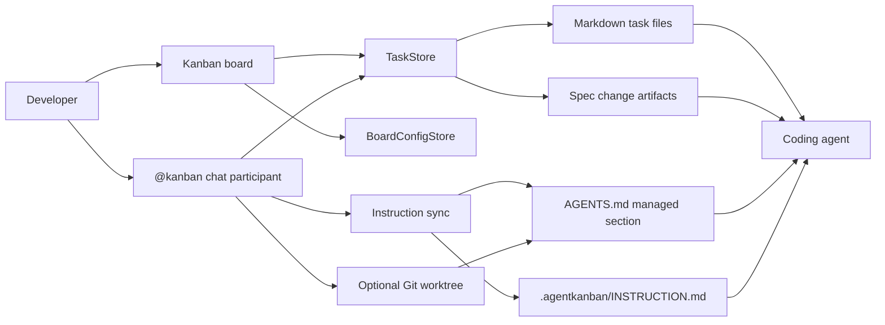
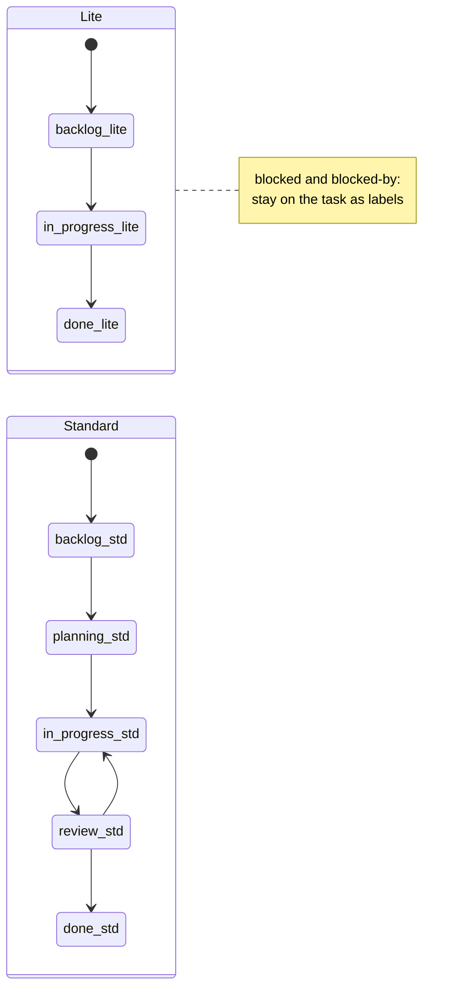
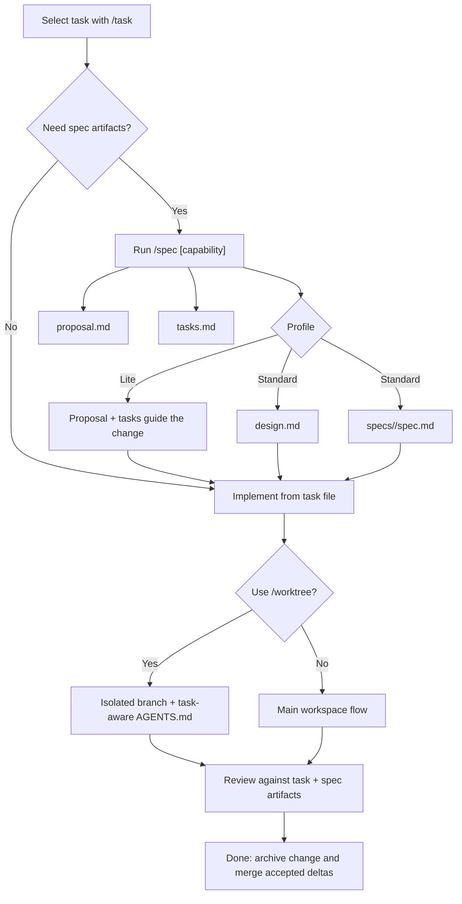

# Agentic Kanban


Spec-driven, agent-assisted software delivery in VS Code, with every plan, checklist, conversation, blocker, and specification kept as durable, version-control-friendly Markdown.


[](LICENSE)
[](https://github.com/milzamsz/vscode-agentic-kanban/releases)

Agentic Kanban pairs a visual board with the `@kanban` chat participant, Git worktrees, and a reusable agent skill so humans and coding agents share one workflow. Tasks move through fixed delivery lanes, `/spec` attaches spec-driven artifacts to a task, and the skill drives dependency-aware lane sweeps that stay coherent across long agent sessions.

> **Key concept:** fixed lanes plus Markdown task records create a human-in-the-loop, spec-driven workflow that an agent can drive end to end.



> **Workflow rules:** `.agentkanban/INSTRUCTION.md` is the canonical source for all workflow rules, lane descriptions, and the action vocabulary. The README below provides the product overview. For detailed workflow guidance, refer to `INSTRUCTION.md` in your workspace (or bundled in `assets/INSTRUCTION.md`).

## How It Works

Agentic Kanban is built for agentic, spec-driven development (SDD):

1. **One durable workflow.** Board state lives entirely in Markdown under `.agentkanban/`. Humans edit cards on the board; agents read and write the same task files. Nothing is hidden in an opaque database.
2. **Fixed lanes per profile.** A task always sits in a known lane (`backlog`, `planning`, `in-progress`, `review`, `done`). Lane transitions are explicit, so the workflow stays coherent even across long agent sessions.
3. **Spec artifacts per task.** `/spec` attaches a proposal, design, checklist, and delta specification to the selected task. `tasks.md` becomes the authoritative checklist the agent works against.
4. **Dependency-aware lane sweeps.** The reusable agent skill processes every ready task in a lane in one pass: a task is ready only when all its `dependsOn` tasks are in `done`. Independent ready tasks run in parallel; dependent chains stay ordered.
5. **Layered context injection.** A managed `AGENTS.md` section, chat references, and `/refresh` keep the active task, checklist, and spec artifacts in front of the agent on every turn.

The board is for humans. The skill plus `@kanban` chat commands are for agents. Both operate on the same files.

## Dependency Management

Repository dependencies are managed by Dependabot on a weekly schedule:

- **npm** (`package.json`/`package-lock.json`) — grouped minor/patch updates
- **GitHub Actions** (`.github/workflows/`) — grouped updates

Dependabot runs every Monday, targets `main`, and creates pull requests with manual review. Labels: `dependencies`, `npm`, `github-actions`.

## Quick Start

1. Install the extension (see [Installation](#installation)).
2. Open a workspace in VS Code and click the **Agentic Kanban** icon in the Activity Bar.
3. Initialise the workspace and choose a profile: **Lite** for fast paths, **Standard** for the full spec-driven lifecycle.
4. Create and select a task:

   ```text
   @kanban /new Add OAuth2 login
   @kanban /task Add OAuth2
   ```

5. Attach spec artifacts and work the lanes:

   ```text
   @kanban /spec auth
   ```

   Refine the proposal, design, and checklist in `planning`, implement in `in-progress`, verify in `review`, then archive in `done`.
6. Re-inject context whenever a long chat drifts:

   ```text
   @kanban /refresh
   ```

For the agent-driven version of this loop, install the [reusable skill](#driving-it-with-an-agent) and point your agent at the stage prompts.

> `TODO` is a checklist artifact (`- [ ]` items in `tasks.md` or a `todo_*.md` file). It is **not** a lane.

## Worked Example

A single feature taken end to end on the **Standard** profile. Each step is an explicit lane transition; the agent records its work in the task file.

**1. Create and select the task** (lands in `backlog`):

```text
@kanban /new Add OAuth2 login
@kanban /task Add OAuth2
```

**2. Attach spec artifacts** with `/spec`. On Standard this scaffolds:

```text
.agentkanban/changes/add-oauth2-login/
  proposal.md
  design.md
  tasks.md
  specs/auth/spec.md
```

```text
@kanban /spec auth
```

The task frontmatter is linked with `change: .agentkanban/changes/add-oauth2-login`.

**3. `backlog -> planning`.** Refine `proposal.md` (why + scope), `design.md` (approach), and the `specs/auth/spec.md` delta (`### Requirement:` blocks with `#### Scenario:` GIVEN / WHEN / THEN), then build the `tasks.md` checklist. Moving out of `planning` is the explicit plan-approval step.

**4. Model a dependency.** Suppose OAuth2 needs token storage first. Create that task and mark the dependency on the OAuth2 task:

```yaml
dependsOn:
  - establish-auth-storage
labels:
  - blocked-by:establish-auth-storage
```

The skill's guardrail keeps "Add OAuth2 login" out of any sweep until `establish-auth-storage` reaches `done`. Independent ready tasks in the same lane are swept in parallel; this dependent chain stays ordered.

**5. `planning -> in-progress`.** Standard requires a worktree for implementation:

```text
@kanban /worktree
```

The extension commits the task record, creates an `agentkanban/add-oauth2-login` branch and worktree, and writes task-aware guidance into the worktree's `AGENTS.md`. Implement against the approved artifacts and check off `tasks.md` as work lands.

**6. `in-progress -> review`.** Verify the implementation against the proposal, design, delta spec, and checklist. Run lint, tests, and build; fix findings before advancing.

**7. `review -> done`.** Archive the change and merge the accepted delta into `.agentkanban/specs/auth/spec.md`, then merge the worktree branch through your normal Git flow and remove the worktree.

Each transition maps to a stage prompt in the reusable skill, so an agent can run this loop for one task or sweep a whole lane at once.

## Driving It With an Agent

The repository includes `skills/agentic-kanban/`, a reusable workflow skill that turns the board into an agent-operable system. It provides:

- profile and lane rules;
- stage prompts for planning, implementation, review, blocking, and completion;
- dependency-aware lane sweeps (process all ready tasks in a lane in one pass);
- spec-driven development guidance;
- worktree, verification, branding, and packaging references.

The skill works with Codex, Claude, Antigravity, or as repo-local instructions for any compatible agent. It is intentionally excluded from the VSIX package.

For a shared cross-tool installation, place the canonical copy at:

```text
~/.agents/skills/agentic-kanban/
```

Then link each tool's discovery directory to that canonical copy:

```text
~/.codex/skills/agentic-kanban
~/.claude/skills/agentic-kanban
~/.antigravity/skills/agentic-kanban
```

On Unix-like systems:

```bash
mkdir -p ~/.agents/skills ~/.codex/skills ~/.claude/skills ~/.antigravity/skills
cp -R skills/agentic-kanban ~/.agents/skills/
ln -s ~/.agents/skills/agentic-kanban ~/.codex/skills/agentic-kanban
ln -s ~/.agents/skills/agentic-kanban ~/.claude/skills/agentic-kanban
ln -s ~/.agents/skills/agentic-kanban ~/.antigravity/skills/agentic-kanban
```

On Windows PowerShell, directory junctions avoid Developer Mode requirements:

```powershell
New-Item -ItemType Directory -Force "$HOME\.agents\skills", "$HOME\.codex\skills", "$HOME\.claude\skills", "$HOME\.antigravity\skills"
Copy-Item -Recurse ".\skills\agentic-kanban" "$HOME\.agents\skills\"
New-Item -ItemType Junction -Path "$HOME\.codex\skills\agentic-kanban" -Target "$HOME\.agents\skills\agentic-kanban"
New-Item -ItemType Junction -Path "$HOME\.claude\skills\agentic-kanban" -Target "$HOME\.agents\skills\agentic-kanban"
New-Item -ItemType Junction -Path "$HOME\.antigravity\skills\agentic-kanban" -Target "$HOME\.agents\skills\agentic-kanban"
```

Remove or rename an existing destination before creating a link at the same path. For VS Code, a repo-local copy under the project's skill directory also works.

## Installation

### GitHub Release VSIX

Download `agentic-kanban-<version>.vsix` from [GitHub Releases](https://github.com/milzamsz/vscode-agentic-kanban/releases), then install it in VS Code:

```bash
code --install-extension agentic-kanban-1.6.0.vsix
```

To update later, download the newer VSIX from the same release page and run the same command again.

### Other Channels

Marketplace publishing is currently optional for this fork. If those channels are available again, you can also use:

- [Visual Studio Marketplace](https://marketplace.visualstudio.com/items?itemName=milzam.agentic-kanban)
- [Open VSX](https://open-vsx.org/extension/milzam/agentic-kanban)

### Build From Source

```bash
git clone https://github.com/milzamsz/vscode-agentic-kanban.git
cd vscode-agentic-kanban
npm ci
npm run build
npx @vscode/vsce package
code --install-extension agentic-kanban-1.6.0.vsix
```

## Workflow Profiles

### Lite

```text
backlog -> in-progress -> done
```

Lite is intended for smaller changes and fast paths. Planning can remain lightweight, worktrees are optional by default, and there is no separate review lane.

### Standard

```text
backlog -> planning -> in-progress -> review -> done
```

Standard separates planning, implementation, and implementation review. Moving from `planning` to `in-progress` is the explicit plan approval step. Worktrees are required by the default Standard policy, and a task must pass through `review` before `done`.

Blockers do not move a task into a special lane. Add `blocked` for an external blocker or `blocked-by:<slug>` for a task dependency while leaving the task in its active lane.



## Spec-Driven Development

After selecting a task, run:

```text
@kanban /spec [capability]
```

The extension links the task to a change with:

```yaml
change: .agentkanban/changes/<task-slug>
```

Standard creates:

```text
.agentkanban/changes/<task-slug>/
  proposal.md
  design.md
  tasks.md
  specs/<capability>/spec.md
```

Lite creates `proposal.md` and `tasks.md`; a delta spec remains optional. Existing artifact files are preserved when `/spec` is run again.

For spec-driven tasks, `tasks.md` is the authoritative checklist:

- `planning`: refine the proposal, design, tasks, and delta specification.
- `in-progress`: implement the approved artifacts and check off `tasks.md`.
- `review`: verify implementation against the proposal, design, delta specification, and checklist.
- `done`: archive the change and merge accepted deltas into `.agentkanban/specs/`.

Validation, archive, and delta merging are agent-driven in this MVP. The delta format is compatible with [Fission-AI/OpenSpec](https://github.com/Fission-AI/OpenSpec), which inspired the proposal and requirement structure.



## Chat Commands

| Command | Usage | Description |
| --- | --- | --- |
| `/new` | `@kanban /new <title>` | Create a task |
| `/task` | `@kanban /task <task name>` | Select and open an active task |
| `/refresh` | `@kanban /refresh [context]` | Re-inject workflow and selected-task context |
| `/spec` | `@kanban /spec [capability]` | Scaffold task-linked spec-driven development artifacts |
| `/worktree` | `@kanban /worktree` | Create a worktree for the selected task |
| `/worktree open` | `@kanban /worktree open` | Open the selected task's existing worktree |
| `/worktree remove` | `@kanban /worktree remove` | Remove the selected task's worktree and branch |

Task matching is fuzzy and case-insensitive. Tasks in `done` are excluded from active task selection.

## Ways of Working

### Main Workspace

Use this flow for small and medium tasks when editing the current working tree is appropriate:

1. Run `@kanban /task <task name>`.
2. Plan, implement, or review according to the current lane.
3. Run `@kanban /refresh` if context drifts.

The extension references the workflow instructions and selected task in chat, opens the task file, and updates the managed `AGENTS.md` section.

### Git Worktree

Use this flow for larger, riskier, or parallel work:

1. Select a task with `@kanban /task <task name>`.
2. Run `@kanban /worktree`, or use the worktree action on the board.
3. The extension commits the current task record, creates an `agentkanban/<task-slug>` branch and worktree, and writes task-specific guidance into the worktree's `AGENTS.md`.
4. Work in the isolated VS Code workspace.
5. Merge through your normal Git workflow, then remove the worktree when it is no longer needed.

In a linked worktree, `/task`, `/refresh`, and `/spec` can auto-detect the associated task. Use `@kanban /worktree open` to reopen it and `@kanban /worktree remove` to remove the worktree and branch.

## Task Files

Tasks are Markdown files with YAML frontmatter:

```markdown
---
title: Implement OAuth2
lane: planning
created: 2026-06-15T10:00:00.000Z
updated: 2026-06-15T14:30:00.000Z
description: Add OAuth2 authentication to the API
priority: high
labels:
  - backend
dependsOn:
  - establish-auth-storage
change: .agentkanban/changes/implement_oauth2
---

## Conversation

### user

Plan the OAuth2 implementation.

### agent

I will start by mapping the current authentication boundaries.
```

Known metadata includes `title`, `lane`, `created`, `updated`, `description`, `priority`, `assignee`, `labels`, `dueDate`, `sortOrder`, `slug`, and `worktree`. Unknown keys such as `dependsOn` and `change` are preserved across extension saves.

Archived tasks move to `.agentkanban/tasks/archive/` and retain their lane metadata.

### Conversation Markers

| Marker | Meaning |
| --- | --- |
| `### user` | User instructions, context, or questions |
| `### agent` | Agent response or work record |
| `[comment: text]` | Inline user annotation |

While editing a task file, type `/` for `User Turn`, `Agent Turn`, and `Comment` completions. These completions are disabled inside frontmatter and fenced code blocks.

## Storage Layout

```text
.agentkanban/
  .gitignore
  board.yaml
  memory.md
  INSTRUCTION.md
  specs/
    <capability>/spec.md
  changes/
    <task-slug>/
      proposal.md
      design.md
      tasks.md
      specs/<capability>/spec.md
    archive/
      <yyyymmdd>-<task-slug>/
  tasks/
    task_<date>_<id>_<slug>.md
    todo_<date>_<id>_<slug>.md
    archive/
  logs/
```

All active tasks live directly under `tasks/`; lane state is stored in frontmatter. Non-spec tasks may use the sibling `todo_*.md` checklist. Spec-driven tasks use their change-level `tasks.md`.

## Dependencies And Blockers

Record task dependencies on the dependent task:

```yaml
dependsOn:
  - database-foundation
labels:
  - blocked-by:database-foundation
```

`dependsOn` is authoritative. The matching `blocked-by:<slug>` label is the visible board mirror and receives blocker styling. Use the plain `blocked` label for external blockers that are not represented by another task.

The reusable workflow skill applies a dependency guardrail: a task is ready only when every referenced dependency is in `done`. Independent ready tasks can be processed in parallel, while dependent chains remain ordered.

## Agent Context Injection

Agentic Kanban uses several context layers:

1. **Managed `AGENTS.md` section:** Written between sentinel comments without changing user-authored content outside the block. VS Code can re-inject this guidance on every agent turn.
2. **Chat references:** `/task` and `/refresh` attach `.agentkanban/INSTRUCTION.md` and the selected task file to the response.
3. **Task-specific worktree guidance:** A linked worktree's managed section identifies the active task, checklist, and spec artifacts.
4. **On-demand refresh:** `/refresh` re-syncs instructions and task references when needed.

`.agentkanban/INSTRUCTION.md` is managed by the extension and refreshed from the bundled template. Put custom permanent guidance in your own `AGENTS.md` content, `CLAUDE.md`, repository rules, or the configured custom instruction file.

## Configuration

| Setting | Scope | Default | Description |
| --- | --- | --- | --- |
| `agentKanban.enableLogging` | Window | `false` | Enable rolling diagnostic logs under `.agentkanban/logs/`; reload after changing |
| `agentKanban.customInstructionFile` | Resource | empty | Additional instruction file for `/task`; relative paths resolve from the workspace root |
| `agentKanban.defaultProfile` | Resource | `standard` | Profile used when initialising a new board; existing `board.yaml` files stay authoritative until settings are applied explicitly |
| `agentKanban.enforcementMode` | Resource | `profile-default` | Seeds `enforcement.mode` when a board is created or when settings are applied to an existing board; `profile-default` keeps Lite in `warn` mode and Standard in `strict` mode |
| `agentKanban.worktreeRequiredForImplementation` | Resource | `profile-default` | Seeds `worktreePolicy.requiredForImplementation` when a board is created or when settings are applied to an existing board |
| `agentKanban.worktreeRoot` | Resource | `../{repo}-worktrees` | Worktree root; `{repo}` is replaced with the repository name |
| `agentKanban.worktreeOpenBehavior` | Resource | `current` | Open worktrees in the `current` or a `new` window |
| `agentKanban.enforceWorktrees` | Resource | `false` | Require a task worktree before `/refresh`, prompting for creation when absent |

### Board Configuration

VS Code settings seed `board.yaml`; they do not silently override it. `board.yaml` remains the committed project source of truth for the board profile, lanes, enforcement mode, review policy, and worktree policy shared by humans and agents.

Use **Agentic Kanban: Apply Settings to Board Config** when you want the current workspace settings to update an existing `board.yaml`. If the target profile would leave tasks in lanes that do not exist in that profile, the command warns before applying the change. Human overrides still respect the board's `enforcement.overrides` policy, and agent guidance is refreshed from the live `enforcement` and `reviewPolicy` values in `board.yaml`.

## Maintainer Release Flow

GitHub Releases is the primary distribution path for this fork.

1. Update the version in `package.json` and any matching release docs.
2. Commit the release changes on `main`.
3. Create the release tag:

```bash
git tag v1.6.0
```

4. Push the branch and tag:

```bash
git push origin main
git push origin v1.6.0
```

5. Wait for GitHub Actions to run the release workflow.
6. Verify the new GitHub Release includes `agentic-kanban-1.6.0.vsix` and that the install command works in VS Code.

## Development

Requirements: Node.js, npm, and VS Code 1.95 or newer.

```bash
npm ci
npm run build
npm run watch
npm run lint
npm test
npx @vscode/vsce package
```

Press `F5` in VS Code to launch the Extension Development Host.

The release verification sequence is:

```bash
npm run lint
npm test
npm run build
npx @vscode/vsce package
```

## Contributing

Use [GitHub Issues](https://github.com/milzamsz/vscode-agentic-kanban/issues) for bugs and proposals. Pull requests are welcome at [milzamsz/vscode-agentic-kanban](https://github.com/milzamsz/vscode-agentic-kanban).

Please keep workflow behavior documented, add focused tests for code changes, and run the full verification sequence before opening a pull request. Contributions are accepted under the repository's Elastic License 2.0 terms, so review the license before submitting work.

## Credits

Agentic Kanban is a maintained fork of the original extension.

- [appsoftwareltd/vscode-agent-kanban](https://github.com/appsoftwareltd/vscode-agent-kanban), the original VS Code extension by appsoftware.com.
- [Fission-AI/OpenSpec](https://github.com/Fission-AI/OpenSpec), whose specification format informs the compatible `/spec` artifacts.

## License

Source-available under the [Elastic License 2.0](LICENSE).

Original work copyright appsoftware.com. This fork is maintained by milzamsz. The license terms, notices, and upstream attribution must be preserved when redistributing modified copies.
