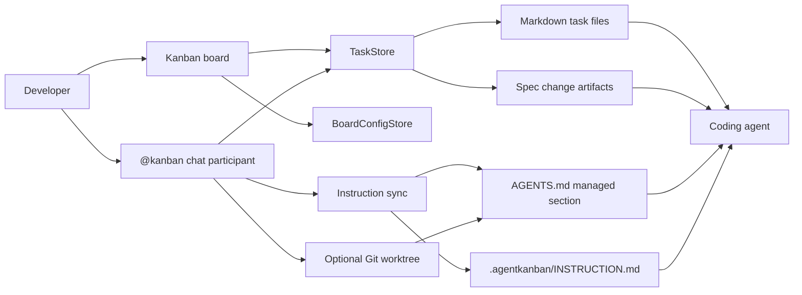
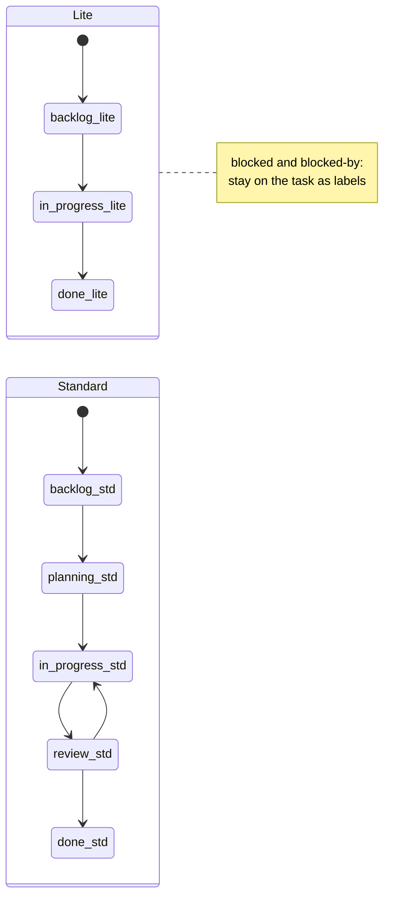
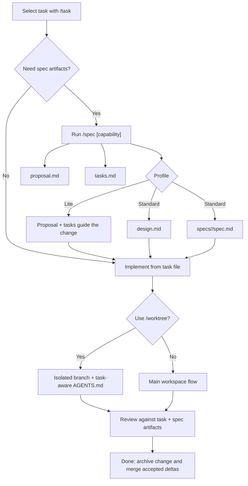

# Agentic Kanban

A profile-driven Kanban board for durable, agent-assisted software development in VS Code.


[](LICENSE)
[](https://marketplace.visualstudio.com/items?itemName=milzam.agentic-kanban)
[](https://open-vsx.org/extension/milzam/agentic-kanban)

A maintained fork of the original extension. See [Credits](#credits).

Agentic Kanban keeps delivery state, plans, checklists, conversations, blockers, and optional specifications in version-control-friendly Markdown. It integrates a visual board with the `@kanban` chat participant, Git worktrees, and layered agent instructions so humans and coding agents can share one durable workflow.

> **Key concept:** fixed delivery lanes plus Markdown task records create a human-in-the-loop workflow that stays coherent across long agent sessions.




The original [quick demo video](https://www.youtube.com/watch?v=Y4a3FnFftKw) and screenshot below are retained as legacy illustrations. Some labels and flows shown there predate the current profiles.


## Features

- **Profile-driven Kanban board:** Lite uses `backlog -> in-progress -> done`; Standard uses `backlog -> planning -> in-progress -> review -> done`. Standard has one implementation review lane and no blocked lane.
- **Markdown task records:** Each task is a readable `.md` file with YAML frontmatter and `### user`, `### agent`, and `[comment: ...]` conversation markers.
- **`@kanban` chat participant:** Create, select, refresh, spec-drive, and isolate tasks without adding a custom LLM loop.
- **Layered agent context:** A managed `AGENTS.md` section, chat references, `/refresh`, and open task files reinforce workflow context across long sessions.
- **Git worktree flow:** Give a task its own `agentkanban/<task-slug>` branch and working directory while preserving task-specific instructions.
- **Dependencies and blockers:** `dependsOn` is the authoritative dependency list; `blocked` and `blocked-by:<slug>` labels keep blockers visible on cards without changing lanes.
- **Spec-driven development:** `/spec` creates task-linked proposal, design, checklist, and delta-spec artifacts appropriate to the selected profile.
- **Reusable agent skill:** `skills/agentic-kanban/` contains workflow guidance and stage prompts for Codex, Claude, Antigravity, and repo-local use.
- **Version-control friendly:** Board configuration, tasks, conversations, checklists, memory, and specifications are plain text files that can be reviewed with normal Git tools.

## Installation

### VS Code Marketplace

Install [Agentic Kanban from the Visual Studio Marketplace](https://marketplace.visualstudio.com/items?itemName=milzam.agentic-kanban), or run:

```bash
code --install-extension milzam.agentic-kanban
```

### Open VSX

Install [Agentic Kanban from Open VSX](https://open-vsx.org/extension/milzam/agentic-kanban) in compatible editors.

### GitHub Release VSIX

Download `agentic-kanban-<version>.vsix` from [GitHub Releases](https://github.com/milzamsz/vscode-agentic-kanban/releases), then run:

```bash
code --install-extension agentic-kanban-1.2.0.vsix
```

### Build From Source

```bash
git clone https://github.com/milzamsz/vscode-agentic-kanban.git
cd vscode-agentic-kanban
npm ci
npm run build
npx @vscode/vsce package
code --install-extension agentic-kanban-1.2.0.vsix
```

## Quick Start

1. Open a workspace in VS Code.
2. Click the Agentic Kanban icon in the Activity Bar.
3. Initialise the workspace and choose Lite or Standard.
4. Create a task from the board or run `@kanban /new <title>`.
5. Select it with `@kanban /task <task name>`.
6. Work through the profile lanes using the task file as the durable conversation record.
7. Run `@kanban /refresh` when a long chat needs its task and workflow context re-injected.

Suggested action vocabulary: `plan`, `checklist`, `implement`, `review`, `block`, and `unblock`.

`TODO` means a checklist artifact. It is not a lane.

## Workflow Profiles

### Lite

```text
backlog -> in-progress -> done
```

Lite is intended for smaller changes and fast paths. Planning can remain lightweight, worktrees are optional by default, and there is no separate review lane.

### Standard

```text
backlog -> planning -> in-progress -> review -> done
```

Standard separates planning, implementation, and implementation review. Moving from `planning` to `in-progress` is the explicit plan approval step. Worktrees are required by the default Standard policy, and a task must pass through `review` before `done`.

Blockers do not move a task into a special lane. Add `blocked` for an external blocker or `blocked-by:<slug>` for a task dependency while leaving the task in its active lane.



## Ways of Working

### Main Workspace

Use this flow for small and medium tasks when editing the current working tree is appropriate:

1. Run `@kanban /task <task name>`.
2. Plan, implement, or review according to the current lane.
3. Run `@kanban /refresh` if context drifts.

The extension references the workflow instructions and selected task in chat, opens the task file, and updates the managed `AGENTS.md` section.

### Git Worktree

Use this flow for larger, riskier, or parallel work:

1. Select a task with `@kanban /task <task name>`.
2. Run `@kanban /worktree`, or use the worktree action on the board.
3. The extension commits the current task record, creates an `agentkanban/<task-slug>` branch and worktree, and writes task-specific guidance into the worktree's `AGENTS.md`.
4. Work in the isolated VS Code workspace.
5. Merge through your normal Git workflow, then remove the worktree when it is no longer needed.

In a linked worktree, `/task`, `/refresh`, and `/spec` can auto-detect the associated task. Use `@kanban /worktree open` to reopen it and `@kanban /worktree remove` to remove the worktree and branch.

## Chat Commands

| Command | Usage | Description |
| --- | --- | --- |
| `/new` | `@kanban /new <title>` | Create a task |
| `/task` | `@kanban /task <task name>` | Select and open an active task |
| `/refresh` | `@kanban /refresh [context]` | Re-inject workflow and selected-task context |
| `/spec` | `@kanban /spec [capability]` | Scaffold task-linked spec-driven development artifacts |
| `/worktree` | `@kanban /worktree` | Create a worktree for the selected task |
| `/worktree open` | `@kanban /worktree open` | Open the selected task's existing worktree |
| `/worktree remove` | `@kanban /worktree remove` | Remove the selected task's worktree and branch |

Task matching is fuzzy and case-insensitive. Tasks in `done` are excluded from active task selection.

## Spec-Driven Development

After selecting a task, run:

```text
@kanban /spec [capability]
```

The extension links the task to a change with:

```yaml
change: .agentkanban/changes/<task-slug>
```

Standard creates:

```text
.agentkanban/changes/<task-slug>/
  proposal.md
  design.md
  tasks.md
  specs/<capability>/spec.md
```

Lite creates `proposal.md` and `tasks.md`; a delta spec remains optional. Existing artifact files are preserved when `/spec` is run again.

For spec-driven tasks, `tasks.md` is the authoritative checklist:

- `planning`: refine the proposal, design, tasks, and delta specification.
- `in-progress`: implement the approved artifacts and check off `tasks.md`.
- `review`: verify implementation against the proposal, design, delta specification, and checklist.
- `done`: archive the change and merge accepted deltas into `.agentkanban/specs/`.

Validation, archive, and delta merging are agent-driven in this MVP. The delta format is compatible with [Fission-AI/OpenSpec](https://github.com/Fission-AI/OpenSpec), which inspired the proposal and requirement structure.



## Task Files

Tasks are Markdown files with YAML frontmatter:

```markdown
---
title: Implement OAuth2
lane: planning
created: 2026-06-15T10:00:00.000Z
updated: 2026-06-15T14:30:00.000Z
description: Add OAuth2 authentication to the API
priority: high
labels:
  - backend
dependsOn:
  - establish-auth-storage
change: .agentkanban/changes/implement_oauth2
---

## Conversation

### user

Plan the OAuth2 implementation.

### agent

I will start by mapping the current authentication boundaries.
```

Known metadata includes `title`, `lane`, `created`, `updated`, `description`, `priority`, `assignee`, `labels`, `dueDate`, `sortOrder`, `slug`, and `worktree`. Unknown keys such as `dependsOn` and `change` are preserved across extension saves.

Archived tasks move to `.agentkanban/tasks/archive/` and retain their lane metadata.

### Conversation Markers

| Marker | Meaning |
| --- | --- |
| `### user` | User instructions, context, or questions |
| `### agent` | Agent response or work record |
| `[comment: text]` | Inline user annotation |

While editing a task file, type `/` for `User Turn`, `Agent Turn`, and `Comment` completions. These completions are disabled inside frontmatter and fenced code blocks.

## Storage Layout

```text
.agentkanban/
  .gitignore
  board.yaml
  memory.md
  INSTRUCTION.md
  specs/
    <capability>/spec.md
  changes/
    <task-slug>/
      proposal.md
      design.md
      tasks.md
      specs/<capability>/spec.md
    archive/
      <yyyymmdd>-<task-slug>/
  tasks/
    task_<date>_<id>_<slug>.md
    todo_<date>_<id>_<slug>.md
    archive/
  logs/
```

All active tasks live directly under `tasks/`; lane state is stored in frontmatter. Non-spec tasks may use the sibling `todo_*.md` checklist. Spec-driven tasks use their change-level `tasks.md`.

## Dependencies And Blockers

Record task dependencies on the dependent task:

```yaml
dependsOn:
  - database-foundation
labels:
  - blocked-by:database-foundation
```

`dependsOn` is authoritative. The matching `blocked-by:<slug>` label is the visible board mirror and receives blocker styling. Use the plain `blocked` label for external blockers that are not represented by another task.

The reusable workflow skill applies a dependency guardrail: a task is ready only when every referenced dependency is in `done`. Independent ready tasks can be processed in parallel, while dependent chains remain ordered.

## Agent Context Injection

Agentic Kanban uses several context layers:

1. **Managed `AGENTS.md` section:** Written between sentinel comments without changing user-authored content outside the block. VS Code can re-inject this guidance on every agent turn.
2. **Chat references:** `/task` and `/refresh` attach `.agentkanban/INSTRUCTION.md` and the selected task file to the response.
3. **Task-specific worktree guidance:** A linked worktree's managed section identifies the active task, checklist, and spec artifacts.
4. **On-demand refresh:** `/refresh` re-syncs instructions and task references when needed.

`.agentkanban/INSTRUCTION.md` is managed by the extension and refreshed from the bundled template. Put custom permanent guidance in your own `AGENTS.md` content, `CLAUDE.md`, repository rules, or the configured custom instruction file.

## Reusable Agent Skill

The repository includes `skills/agentic-kanban/`, a reusable workflow skill with:

- profile and lane rules;
- stage prompts for planning, implementation, review, blocking, and completion;
- dependency-aware lane sweeps;
- spec-driven development guidance;
- worktree, verification, branding, and packaging references.

The skill is useful with Codex, Claude, Antigravity, or as repo-local instructions for any compatible agent. It is intentionally excluded from the VSIX package.

For a shared cross-tool installation, place the canonical copy at:

```text
~/.agents/skills/agentic-kanban/
```

Then link each tool's discovery directory to that canonical copy:

```text
~/.codex/skills/agentic-kanban
~/.claude/skills/agentic-kanban
~/.antigravity/skills/agentic-kanban
```

On Unix-like systems:

```bash
mkdir -p ~/.agents/skills ~/.codex/skills ~/.claude/skills ~/.antigravity/skills
cp -R skills/agentic-kanban ~/.agents/skills/
ln -s ~/.agents/skills/agentic-kanban ~/.codex/skills/agentic-kanban
ln -s ~/.agents/skills/agentic-kanban ~/.claude/skills/agentic-kanban
ln -s ~/.agents/skills/agentic-kanban ~/.antigravity/skills/agentic-kanban
```

On Windows PowerShell, directory junctions avoid Developer Mode requirements:

```powershell
New-Item -ItemType Directory -Force "$HOME\.agents\skills", "$HOME\.codex\skills", "$HOME\.claude\skills", "$HOME\.antigravity\skills"
Copy-Item -Recurse ".\skills\agentic-kanban" "$HOME\.agents\skills\"
New-Item -ItemType Junction -Path "$HOME\.codex\skills\agentic-kanban" -Target "$HOME\.agents\skills\agentic-kanban"
New-Item -ItemType Junction -Path "$HOME\.claude\skills\agentic-kanban" -Target "$HOME\.agents\skills\agentic-kanban"
New-Item -ItemType Junction -Path "$HOME\.antigravity\skills\agentic-kanban" -Target "$HOME\.agents\skills\agentic-kanban"
```

Remove or rename an existing destination before creating a link at the same path.

## Configuration

| Setting | Scope | Default | Description |
| --- | --- | --- | --- |
| `agentKanban.enableLogging` | Window | `false` | Enable rolling diagnostic logs under `.agentkanban/logs/`; reload after changing |
| `agentKanban.customInstructionFile` | Resource | empty | Additional instruction file for `/task`; relative paths resolve from the workspace root |
| `agentKanban.worktreeRoot` | Resource | `../{repo}-worktrees` | Worktree root; `{repo}` is replaced with the repository name |
| `agentKanban.worktreeOpenBehavior` | Resource | `current` | Open worktrees in the `current` or a `new` window |
| `agentKanban.enforceWorktrees` | Resource | `false` | Require a task worktree before `/refresh`, prompting for creation when absent |

## Development

Requirements: Node.js, npm, and VS Code 1.95 or newer.

```bash
npm ci
npm run build
npm run watch
npm run lint
npm test
npx @vscode/vsce package
```

Press `F5` in VS Code to launch the Extension Development Host.

The release verification sequence is:

```bash
npm run lint
npm test
npm run build
npx @vscode/vsce package
```

## Contributing

Use [GitHub Issues](https://github.com/milzamsz/vscode-agentic-kanban/issues) for bugs and proposals. Pull requests are welcome at [milzamsz/vscode-agentic-kanban](https://github.com/milzamsz/vscode-agentic-kanban).

Please keep workflow behavior documented, add focused tests for code changes, and run the full verification sequence before opening a pull request. Contributions are accepted under the repository's Elastic License 2.0 terms, so review the license before submitting work.

## Credits

- [appsoftwareltd/vscode-agent-kanban](https://github.com/appsoftwareltd/vscode-agent-kanban), the original VS Code extension by appsoftware.com.
- [Fission-AI/OpenSpec](https://github.com/Fission-AI/OpenSpec), whose specification format informs the compatible `/spec` artifacts.

## License

Source-available under the [Elastic License 2.0](LICENSE).

Original work copyright appsoftware.com. This fork is maintained by milzamsz. The license terms, notices, and upstream attribution must be preserved when redistributing modified copies.
