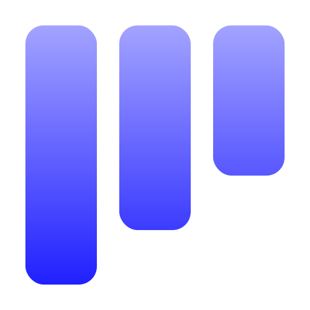
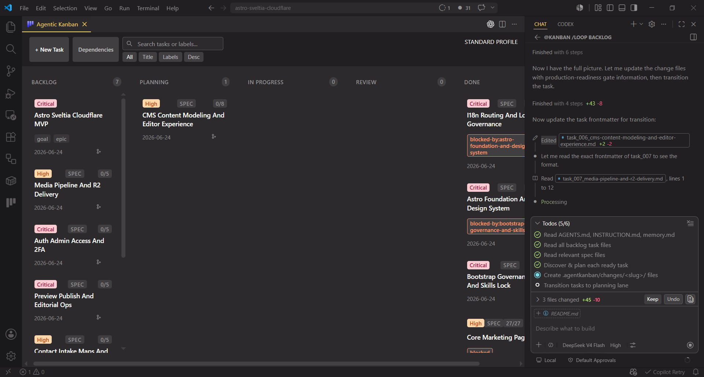
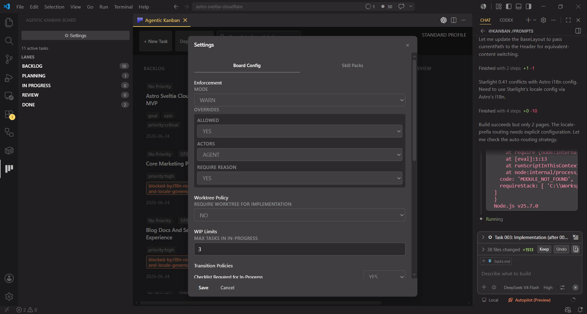
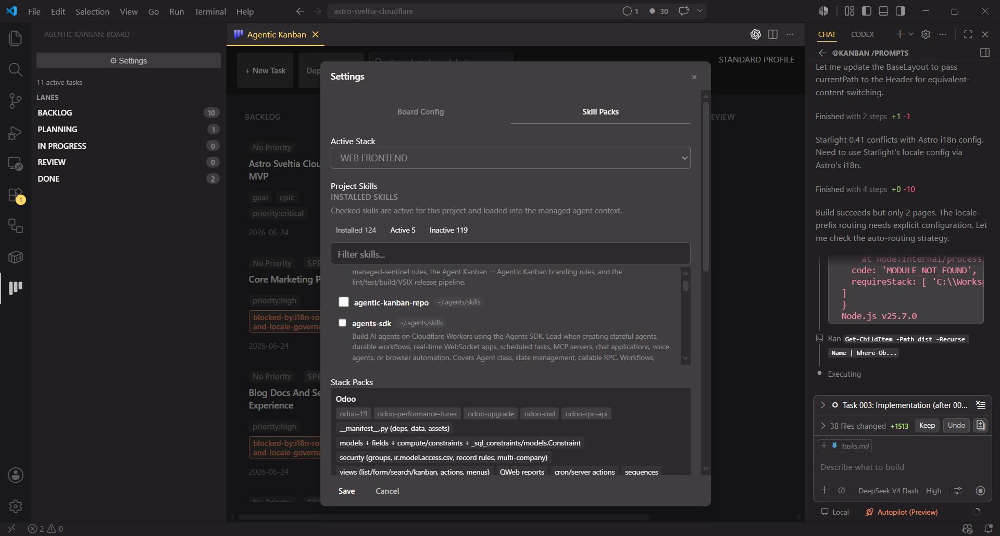
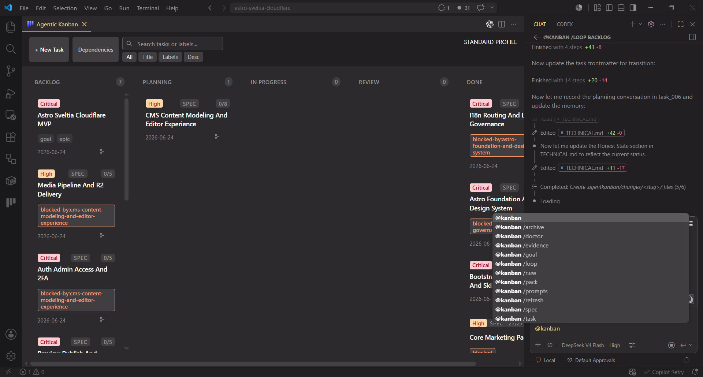
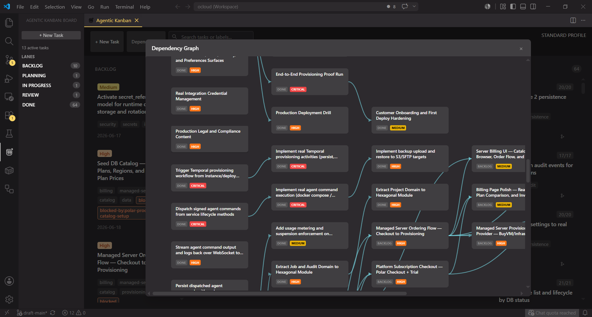
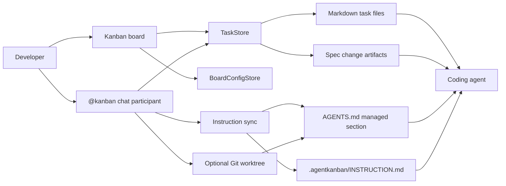
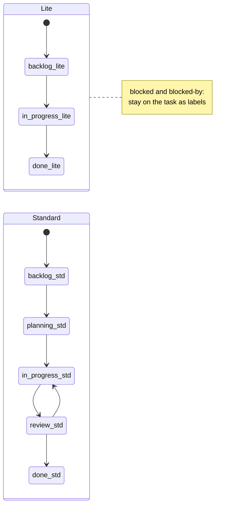
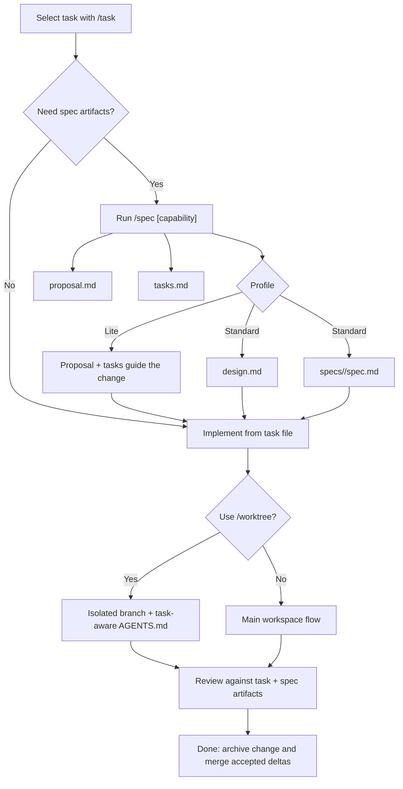

# Agentic Kanban



A VS Code Kanban board where you and a coding agent share the same task files. Pick **Lite** (`backlog → in-progress → done`) for quick changes, or **Standard** (`backlog → planning → in-progress → review → done`) for full spec-driven delivery. Every task, plan, checklist, and conversation lives as a Markdown file in `.agentkanban/` — readable in your editor and trackable in Git.

📖 **[Read the Documentation](https://agentic-kanban-docs.pages.dev/)**


[](LICENSE)
[](https://github.com/milzamsz/vscode-agentic-kanban/releases)

## Screenshots

**The Kanban board — tasks as cards, lanes as columns:**



**Board settings — configure profile, policies, and labels:**



**Project skills — manage installed and active skills:**



**Chat commands — `@kanban` commands in VS Code Chat:**



**Dependency graph — visualize task dependencies:**



---



> **Workflow rules:** `.agentkanban/INSTRUCTION.md` is the canonical source for all workflow rules, lane descriptions, and the action vocabulary. The README below provides the product overview. For detailed workflow guidance, refer to `INSTRUCTION.md` in your workspace (or bundled in `assets/INSTRUCTION.md`).

## How It Works

1. **Open the board, pick a profile.** Click the Activity Bar icon, hit Initialise, choose Lite or Standard. One folder (`.agentkanban/`) holds everything — task files, specs, prompts, and memory.
2. **Create tasks with `@kanban /new`.** Each task becomes a Markdown file with YAML frontmatter. Move cards on the board or type `@kanban /loop` to get the stage-driver prompt for any lane.
3. **Attach specs with `@kanban /spec`.** Scaffolds `proposal.md`, `design.md`, `tasks.md`, and a shared capability spec. The agent works from these artifacts — not from guesswork or stale chat context.
4. **Let `/loop` drive the lanes.** Emits the stage-driver prompt for a lane into chat. Paste it into your agent session; the agent does the work and advances tasks. Dependency-aware: blocked tasks are excluded from the ready list.
5. **Two human gates, no more.** Plan approval (move from `planning` to `in-progress`) and completion (`review → done`). Everything in between the agent handles.

The board is for humans. The `@kanban` commands and reusable skill are for agents. Both operate on the same files.

## Quick Start

1. Install the extension (see [Installation](#installation)).
2. Open a workspace in VS Code and click the **Agentic Kanban** icon in the Activity Bar.
3. Initialise the workspace and choose a profile: **Lite** for fast paths, **Standard** for the full spec-driven lifecycle.
4. Create and select a task:

   ```text
   @kanban /new Add OAuth2 login
   @kanban /task Add OAuth2
   ```

5. Attach spec artifacts and work the lanes:

   ```text
   @kanban /spec auth
   ```

   Refine the proposal, design, and checklist in `planning`, implement in `in-progress`, verify in `review`, then archive in `done`.
6. Re-inject context whenever a long chat drifts:

   ```text
   @kanban /refresh
   ```

For the agent-driven version of this loop, install the [reusable skill](#driving-it-with-an-agent) and point your agent at the stage prompts.

> `TODO` is a checklist artifact (`- [ ]` items in `tasks.md` or a `todo_*.md` file). It is **not** a lane.

## Multi-root Workspaces

Agentic Kanban works in VS Code multi-root workspaces on a per-project basis.

- Each workspace folder keeps its own `.agentkanban/` directory and `board.yaml`.
- Uninitialised folders remain untouched until you initialise that specific project.
- The board shows a project selector when multiple folders are open, including a `Not initialised` label when needed.
- `@kanban` commands, task files, prompts, AGENTS sync, and worktree actions all route through the active project.
- Each project can keep its own workflow profile, so one folder can be `standard` while another stays `lite`.

Single-folder behavior stays unchanged.

## Worked Example

A single feature taken end to end on the **Standard** profile. Each step is an explicit lane transition; the agent records its work in the task file.

**1. Create and select the task** (lands in `backlog`):

```text
@kanban /new Add OAuth2 login
@kanban /task Add OAuth2
```

**2. Attach spec artifacts** with `/spec`. On Standard this scaffolds:

```text
.agentkanban/changes/add-oauth2-login/
  proposal.md
  design.md
  tasks.md
  specs/auth/spec.md
```

```text
@kanban /spec auth
```

The task frontmatter is linked with `change: .agentkanban/changes/add-oauth2-login`.

**3. `backlog -> planning`.** Refine `proposal.md` (why + scope), `design.md` (approach), and the `specs/auth/spec.md` delta (`### Requirement:` blocks with `#### Scenario:` GIVEN / WHEN / THEN), then build the `tasks.md` checklist. Moving out of `planning` is the explicit plan-approval step.

**4. Model a dependency.** Suppose OAuth2 needs token storage first. Create that task and mark the dependency on the OAuth2 task:

```yaml
dependsOn:
  - establish-auth-storage
labels:
  - blocked-by:establish-auth-storage
```

The skill's guardrail keeps "Add OAuth2 login" out of any sweep until `establish-auth-storage` reaches `done`. Independent ready tasks in the same lane are swept in parallel; this dependent chain stays ordered.

**5. `planning -> in-progress`.** A worktree can be created for isolated implementation (optional by default, but recommended for larger Standard tasks):

```text
@kanban /worktree
```

The extension commits the task record, creates an `agentkanban/add-oauth2-login` branch and worktree, and writes task-aware guidance into the worktree's `AGENTS.md`. Implement against the approved artifacts and check off `tasks.md` as work lands.

**6. `in-progress -> review`.** Verify the implementation against the proposal, design, delta spec, and checklist. Run lint, tests, and build; fix findings before advancing.

**7. `review -> done`.** Archive the change and merge the accepted delta into `.agentkanban/specs/auth/spec.md`, then merge the worktree branch through your normal Git flow and remove the worktree.

Each transition maps to a stage prompt in the reusable skill, so an agent can run this loop for one task or sweep a whole lane at once.

## Driving It With an Agent

The repository includes `skills/agentic-kanban/`, a reusable workflow skill that turns the board into an agent-operable system. It provides:

- profile and lane rules;
- stage prompts for planning, implementation, review, blocking, and completion;
- dependency-aware lane sweeps (process all ready tasks in a lane in one pass);
- spec-driven development guidance;
- worktree, verification, branding, and packaging references.

The skill works with Codex, Claude, Antigravity, or as repo-local instructions for any compatible agent. It is intentionally excluded from the VSIX package.

For a shared cross-tool installation, place the canonical copy at:

```text
~/.agents/skills/agentic-kanban/
```

Then link each tool's discovery directory to that canonical copy:

```text
~/.codex/skills/agentic-kanban
~/.claude/skills/agentic-kanban
~/.antigravity/skills/agentic-kanban
```

On Unix-like systems:

```bash
mkdir -p ~/.agents/skills ~/.codex/skills ~/.claude/skills ~/.antigravity/skills
cp -R skills/agentic-kanban ~/.agents/skills/
ln -s ~/.agents/skills/agentic-kanban ~/.codex/skills/agentic-kanban
ln -s ~/.agents/skills/agentic-kanban ~/.claude/skills/agentic-kanban
ln -s ~/.agents/skills/agentic-kanban ~/.antigravity/skills/agentic-kanban
```

On Windows PowerShell, directory junctions avoid Developer Mode requirements:

```powershell
New-Item -ItemType Directory -Force "$HOME\.agents\skills", "$HOME\.codex\skills", "$HOME\.claude\skills", "$HOME\.antigravity\skills"
Copy-Item -Recurse ".\skills\agentic-kanban" "$HOME\.agents\skills\"
New-Item -ItemType Junction -Path "$HOME\.codex\skills\agentic-kanban" -Target "$HOME\.agents\skills\agentic-kanban"
New-Item -ItemType Junction -Path "$HOME\.claude\skills\agentic-kanban" -Target "$HOME\.agents\skills\agentic-kanban"
New-Item -ItemType Junction -Path "$HOME\.antigravity\skills\agentic-kanban" -Target "$HOME\.agents\skills\agentic-kanban"
```

Remove or rename an existing destination before creating a link at the same path. For VS Code, a repo-local copy under the project's skill directory also works.

## Installation

### GitHub Release VSIX

Download `agentic-kanban-<version>.vsix` from [GitHub Releases](https://github.com/milzamsz/vscode-agentic-kanban/releases), then install it in VS Code:

```bash
code --install-extension agentic-kanban-<version>.vsix
```

To update later, download the newer VSIX from the same release page and run the same command again.

### Other Channels

Marketplace publishing is currently optional for this fork. If those channels are available again, you can also use:

- [Visual Studio Marketplace](https://marketplace.visualstudio.com/items?itemName=milzam.agentic-kanban)
- [Open VSX](https://open-vsx.org/extension/milzam/agentic-kanban)

### Build From Source

```bash
git clone https://github.com/milzamsz/vscode-agentic-kanban.git
cd vscode-agentic-kanban
npm ci
npm run build
npx @vscode/vsce package
code --install-extension agentic-kanban-<version>.vsix
```

## Workflow Profiles

### Lite

```text
backlog -> in-progress -> done
```

Lite is intended for smaller changes and fast paths. Planning can remain lightweight, worktrees are optional by default, and there is no separate review lane. `/loop` defaults to `backlog` and emits `stage-backlog-to-inprogress`; use `/loop in-progress` to emit `stage-inprogress-to-done`.

### Standard

```text
backlog -> planning -> in-progress -> review -> done
```

Standard separates planning, implementation, and implementation review. Moving from `planning` to `in-progress` is the explicit plan approval step. Worktrees are optional by default in the Standard profile (configurable in `board.yaml` via `worktreePolicy.requiredForImplementation` or `policies.transition.requireWorktreeForInProgress`), and a task must pass through `review` before `done`. `/loop` defaults to `backlog` and emits `stage-backlog-to-planning`; use `/loop planning`, `/loop in-progress`, or `/loop review` to get the driver prompt for later stages. Gates are enforced when the agent performs the actual board move.

Blockers do not move a task into a special lane. Add `blocked` for an external blocker or `blocked-by:<slug>` for a task dependency while leaving the task in its active lane.



## Spec-Driven Development

After selecting a task, run:

```text
@kanban /spec [capability]
```

The extension links the task to a change with:

```yaml
change: .agentkanban/changes/<task-slug>
```

Standard creates:

```text
.agentkanban/changes/<task-slug>/
  proposal.md
  design.md
  tasks.md
  specs/<capability>/spec.md
```

Lite creates `proposal.md` and `tasks.md`; a delta spec remains optional. Existing artifact files are preserved when `/spec` is run again.

For spec-driven tasks, `tasks.md` is the authoritative checklist:

- `planning`: refine the proposal, design, tasks, and delta specification.
- `in-progress`: implement the approved artifacts and check off `tasks.md`.
- `review`: verify implementation against the proposal, design, delta specification, and checklist.
- `done`: archive the change and merge accepted deltas into `.agentkanban/specs/`.

Validation, archive, and delta merging are agent-driven in this MVP. The delta format is compatible with [Fission-AI/OpenSpec](https://github.com/Fission-AI/OpenSpec), which inspired the proposal and requirement structure.



## Chat Commands

| Command | Usage | Description |
| --- | --- | --- |
| `/new` | `@kanban /new <title>` | Create a task |
| `/task` | `@kanban /task <task name>` | Select and open an active task |
| `/refresh` | `@kanban /refresh [context]` | Re-inject workflow and selected-task context |
| `/spec` | `@kanban /spec [capability]` | Scaffold task-linked spec-driven development artifacts |
| `/worktree` | `@kanban /worktree` | Create a worktree for the selected task |
| `/worktree open` | `@kanban /worktree open` | Open the selected task's existing worktree |
| `/worktree remove` | `@kanban /worktree remove` | Remove the selected task's worktree and branch |
| `/archive` | `@kanban /archive [slug]` | Archive a completed spec change folder |
| `/prompts` | `@kanban /prompts` | Write or refresh bundled stage-driver prompts |
| `/loop` | `@kanban /loop [lane]` | Lane-flow prompt driver: emits the stage-driver prompt for the selected lane into chat. Click the **"Send prompt to chat"** button to inject it directly into the chat input (clipboard copy as fallback). Default lane: `backlog`. Mapping: `backlog` -> `stage-backlog-to-planning`, `planning`/`in-progress` -> `stage-planning-to-review`, `review` -> `stage-review-to-done` (Standard); `backlog` -> `stage-backlog-to-inprogress`, `in-progress` -> `stage-inprogress-to-done` (Lite). Workspace prompt overrides bundled. Appends ready-task list (non-blocked, dep-satisfied). Supports `--label=`, `--priority=` filters. No lanes moved by the command itself. |
| `/goal new` | `@kanban /goal new <objective>` | Create a goal epic card + goal artifact; copy decompose prompt to clipboard |
| `/goal` | `@kanban /goal` | Show goal dashboard (progress per goal) |
| `/goal show` | `@kanban /goal show <slug>` | Show detail for a specific goal |
| `/doctor` | `@kanban /doctor` | Run workflow diagnostics (lane drift, stale blockers, dependency cycles, spec drift) |
| `/work` | `@kanban /work [task]` | Resolve a task and copy the work prompt to the clipboard |
| `/evidence` | `@kanban /evidence [task]` | Show evidence status for a task |
| `/evidence record` | `@kanban /evidence <task> <check> <pass\|fail> ["<notes>"]` | Record a lint, test, build, or behavior evidence result |

Task matching is fuzzy and case-insensitive. Tasks in `done` are excluded from active task selection.

## Ways of Working

### Main Workspace

Use this flow for small and medium tasks when editing the current working tree is appropriate:

1. Run `@kanban /task <task name>`.
2. Plan, implement, or review according to the current lane.
3. Run `@kanban /refresh` if context drifts.

The extension references the workflow instructions and selected task in chat, opens the task file, and updates the managed `AGENTS.md` section.

### Git Worktree

Use this flow for larger, riskier, or parallel work:

1. Select a task with `@kanban /task <task name>`.
2. Run `@kanban /worktree`, or use the worktree action on the board.
3. The extension commits the current task record, creates an `agentkanban/<task-slug>` branch and worktree, and writes task-specific guidance into the worktree's `AGENTS.md`.
4. Work in the isolated VS Code workspace.
5. Merge through your normal Git workflow, then remove the worktree when it is no longer needed.

In a linked worktree, `/task`, `/refresh`, and `/spec` can auto-detect the associated task. Use `@kanban /worktree open` to reopen it and `@kanban /worktree remove` to remove the worktree and branch.

## Task Files

Tasks are Markdown files with YAML frontmatter:

```markdown
---
title: Implement OAuth2
lane: planning
created: 2026-06-15T10:00:00.000Z
updated: 2026-06-15T14:30:00.000Z
description: Add OAuth2 authentication to the API
priority: high
labels:
  - backend
dependsOn:
  - establish-auth-storage
change: .agentkanban/changes/implement_oauth2
---

## Conversation

### user

Plan the OAuth2 implementation.

### agent

I will start by mapping the current authentication boundaries.
```

Known metadata includes `title`, `lane`, `created`, `updated`, `description`, `priority`, `assignee`, `labels`, `dueDate`, `sortOrder`, `slug`, `worktree`, `dependsOn`, `change`, `spec`, `parent`, `superseeds`, `blockerResolved`, and `evidence`. Unknown keys are preserved across extension saves via the `extras` round-trip.

Archived tasks move to `.agentkanban/tasks/archive/` and retain their lane metadata.

### Conversation Markers

| Marker | Meaning |
| --- | --- |
| `### user` | User instructions, context, or questions |
| `### agent` | Agent response or work record |
| `[comment: text]` | Inline user annotation |

While editing a task file, type `/` for `User Turn`, `Agent Turn`, and `Comment` completions. These completions are disabled inside frontmatter and fenced code blocks.

## Storage Layout

```text
.agentkanban/
  .gitignore
  board.yaml
  memory.md
  INSTRUCTION.md
  goals/
    <goal-slug>/
      goal.md          (objective, acceptance criteria, metrics, decomposition)
  specs/
    <capability>/spec.md
  changes/
    <task-slug>/
      proposal.md
      design.md
      tasks.md
      specs/<capability>/spec.md
    archive/
      <yyyymmdd>-<task-slug>/
  tasks/
    task_<date>_<id>_<slug>.md
    todo_<date>_<id>_<slug>.md
    archive/
  logs/
```

All active tasks live directly under `tasks/`; lane state is stored in frontmatter. Non-spec tasks may use the sibling `todo_*.md` checklist. Spec-driven tasks use their change-level `tasks.md`.

## Dependencies And Blockers

Record task dependencies on the dependent task:

```yaml
dependsOn:
  - database-foundation
labels:
  - blocked-by:database-foundation
```

`dependsOn` is authoritative. The matching `blocked-by:<slug>` label is the visible board mirror and receives blocker styling. Use the plain `blocked` label for external blockers that are not represented by another task.

The reusable workflow skill applies a dependency guardrail: a task is ready only when every referenced dependency is in `done`. Independent ready tasks can be processed in parallel, while dependent chains remain ordered.

## Goals

A goal is a high-level objective that spans multiple tasks. Use `/goal new <objective>` to:

1. Create an epic task card in `backlog` with `goal` and `epic` labels.
2. Scaffold `.agentkanban/goals/<slug>/goal.md` (objective, acceptance criteria, success metrics, constraints, decomposition).
3. Copy a profile-aware decompose prompt to clipboard so an agent can break the goal into `parent`-linked child tasks.

**Goal tier above SDD:**

```
goal (epic, why + metrics)
  capability spec (behavior contract, shared across changes)
    change (proposal / design / tasks per task)
      task
```

In Standard profile the decompose prompt recommends running `@kanban /spec <capability>` for complex child tasks, wiring each to a capability spec and change folder. In Lite profile children are lightweight (proposal + tasks only, no design or review gate).

**Pairing with `/loop`:** after decomposition, run `@kanban /loop backlog` to get the backlog-to-planning driver prompt for child tasks, then `/loop planning`, `/loop in-progress`, etc. as work advances through each lane.

**Tracking progress:** `@kanban /goal` shows a dashboard (done/total per goal). `@kanban /goal show <slug>` shows next-ready and blocked children.

Child tasks carry `parent: <goalSlug>` in frontmatter. The epic task carries `goal: .agentkanban/goals/<slug>`.

## Agent Context Injection

Agentic Kanban uses several context layers:

1. **Managed `AGENTS.md` section:** Written between sentinel comments without changing user-authored content outside the block. VS Code can re-inject this guidance on every agent turn.
2. **Chat references:** `/task` and `/refresh` attach `.agentkanban/INSTRUCTION.md` and the selected task file to the response.
3. **Task-specific worktree guidance:** A linked worktree's managed section identifies the active task, checklist, and spec artifacts.
4. **On-demand refresh:** `/refresh` re-syncs instructions and task references when needed.

`.agentkanban/INSTRUCTION.md` is managed by the extension and refreshed from the bundled template. Put custom permanent guidance in your own `AGENTS.md` content, `CLAUDE.md`, repository rules, or the configured custom instruction file.

## Configuration

| Setting | Scope | Default | Description |
| --- | --- | --- | --- |
| `agentKanban.enableLogging` | Window | `false` | Enable rolling diagnostic logs under `.agentkanban/logs/`; reload after changing |
| `agentKanban.customInstructionFile` | Resource | empty | Additional instruction file for `/task`; relative paths resolve from the workspace root |
| `agentKanban.defaultProfile` | Resource | `standard` | Profile used when initialising a new board; existing `board.yaml` files stay authoritative until settings are applied explicitly |
| `agentKanban.enforcementMode` | Resource | `profile-default` | Seeds `enforcement.mode` when a board is created or when settings are applied to an existing board; `profile-default` keeps Lite in `warn` mode and Standard in `strict` mode |
| `agentKanban.worktreeRequiredForImplementation` | Resource | `profile-default` | Seeds `worktreePolicy.requiredForImplementation` when a board is created or when settings are applied to an existing board |
| `agentKanban.worktreeRoot` | Resource | `../{repo}-worktrees` | Worktree root; `{repo}` is replaced with the repository name |
| `agentKanban.worktreeOpenBehavior` | Resource | `current` | Open worktrees in the `current` or a `new` window |
| `agentKanban.enforceWorktrees` | Resource | `false` | Require a task worktree before `/refresh`, prompting for creation when absent |
| `agentKanban.skillsDirs` | Resource | `[]` | Additional skill directories to scan; supports `~/` and workspace-relative paths |

### Board Configuration

VS Code settings seed `board.yaml`; they do not silently override it. `board.yaml` remains the committed project source of truth for the board profile, lanes, enforcement mode, review policy, and worktree policy shared by humans and agents.

Use **Agentic Kanban: Apply Settings to Board Config** when you want the current workspace settings to update an existing `board.yaml`. If the target profile would leave tasks in lanes that do not exist in that profile, the command warns before applying the change. Human overrides still respect the board's `enforcement.overrides` policy, and agent guidance is refreshed from the live `enforcement` and `reviewPolicy` values in `board.yaml`.

### Project Skills Settings

The Settings modal includes a **Project Skills** tab for project-local skill activation.

- **Project-local skills** in `project/.agents/skills/`, `project/skills/`, and `project/.claude/skills/` are discovered automatically and treated as active for the project.
- **Machine-installed skills** are discovered from `~/.agents/skills/`, `~/.codex/skills/`, `~/.claude/skills/`, `~/.antigravity/skills/`, and any extra directories configured through `agentKanban.skillsDirs`.
- **Checked = active**. Checking a machine-installed skill links it into `project/.agents/skills/` so prompts and `AGENTS.md` load it from the project.
- The installed skill list shows **Installed**, **Active**, and **Inactive** filters, plus a source badge for each discovered skill.
- If a skill is a real project-owned folder instead of a link, it stays active until removed manually.
- After adding a new skill folder, reopen Settings to refresh the discovered list.

## Maintainer Release Flow

GitHub Releases is the primary distribution path for this fork.

### Branch Model

This repository follows lightweight GitHub Flow with `main` as the only release source of truth.

- `main`: stable, releasable code
- `agentkanban/<task-slug>`: preferred task branches created through Agentic Kanban worktrees
- `fix/<slug>`: manual bug-fix branches outside the task worktree flow
- `docs/<slug>`: documentation-only branches
- `chore/<slug>`: repository, dependency, CI, or maintenance branches
- `release/<version>`: optional short-lived stabilization branch for larger releases only
- `hotfix/<slug>`: critical production fixes when needed

There is no permanent `develop` branch. Normal flow is:

```text
task branch -> pull request -> main -> tag -> GitHub Release
```

### Pull Request Validation

Every pull request to `main` should pass the full release-critical validation path:

```bash
npm test
npm run lint
npm run build
npx @vscode/vsce package --out /tmp/agentic-kanban-ci.vsix
```

This keeps packaging failures out of the release tag path.

### Patch / Minor Release

1. Start from `main` and create a short-lived release-preparation branch:

```bash
git switch main
git pull --ff-only
git switch -c chore/release-<version>
```

2. Update the version in `package.json`, `package-lock.json`, `CHANGELOG.md`, the README badge, and any matching release docs.
3. Run the full verification sequence:

```bash
npm ci
npm test
npm run lint
npm run build
npx @vscode/vsce package --out /tmp/agentic-kanban-<version>.vsix
```

4. Open a pull request into `main` and merge only after CI passes.
5. After the release commit is on `main`, create the release tag from `main`:

```bash
git switch main
git pull --ff-only
git tag v<version>
git push origin v<version>
```

6. Wait for GitHub Actions to run the release workflow.
7. Verify the new GitHub Release includes `agentic-kanban-<version>.vsix` and that the install command works in VS Code.

Release tags are accepted only when:

- `v<version>` matches `package.json.version`
- the tagged commit is already contained in `main`

### Release Hygiene

- Keep `CHANGELOG.md` updated on `main` before tagging.
- Do not commit `.vsix` files to Git. Local packages are for testing only; the canonical distributable VSIX lives in GitHub Release assets.
- Old long-lived branches such as `release/v1.6.5` or `dependabot-and-lite-enhancements` should be merged or retired before future releases so `main` stays the single source of truth.

### GitHub Repository Setup

Apply these settings in GitHub repository administration:

**Branch ruleset for `main`**
- require pull request before merging
- require status checks
- require conversation resolution
- require linear history
- block force pushes
- block branch deletion

**Required checks**
- require the CI workflow that runs `test`, `lint`, `build`, and `package`

**Approvals**
- single maintainer: `0` required approvals is acceptable if PR + CI are still mandatory
- multiple maintainers: raise to `1` required approval and enable stale approval dismissal

**Tag ruleset for `v*`**
- restrict creation
- restrict updates
- restrict deletion

**General repository setting**
- enable automatic deletion of head branches after merge

## Development

Requirements: Node.js, npm, and VS Code 1.95 or newer.

```bash
npm ci
npm run build
npm run watch
npm run lint
npm test
npx @vscode/vsce package --out /tmp/agentic-kanban-local.vsix
```

Press `F5` in VS Code to launch the Extension Development Host.

The release verification sequence is:

```bash
npm run lint
npm test
npm run build
npx @vscode/vsce package --out /tmp/agentic-kanban-local.vsix
```

## Dependency Management

Repository dependencies are managed by Dependabot on a weekly schedule:

- **npm** (`package.json`/`package-lock.json`) — grouped minor/patch updates
- **GitHub Actions** (`.github/workflows/`) — grouped updates

Dependabot runs every Monday, targets `main`, and creates pull requests with manual review. Labels: `dependencies`, `npm`, `github-actions`.

## Contributing

Use [GitHub Issues](https://github.com/milzamsz/vscode-agentic-kanban/issues) for bugs and proposals. Pull requests are welcome at [milzamsz/vscode-agentic-kanban](https://github.com/milzamsz/vscode-agentic-kanban).

Please keep workflow behavior documented, add focused tests for code changes, and run the full verification sequence before opening a pull request. Contributions are accepted under the repository's Elastic License 2.0 terms, so review the license before submitting work.

When contributing release or CI changes, keep `main` as the only release source of truth and avoid introducing a permanent `develop` branch or committing VSIX artifacts into Git.

## Credits

Agentic Kanban is a maintained fork of the original extension.

- [appsoftwareltd/vscode-agent-kanban](https://github.com/appsoftwareltd/vscode-agent-kanban), the original VS Code extension by appsoftware.com.
- [Fission-AI/OpenSpec](https://github.com/Fission-AI/OpenSpec), whose specification format informs the compatible `/spec` artifacts.

## License

Source-available under the [Elastic License 2.0](LICENSE).

Original work copyright appsoftware.com. This fork is maintained by milzamsz. The license terms, notices, and upstream attribution must be preserved when redistributing modified copies.
