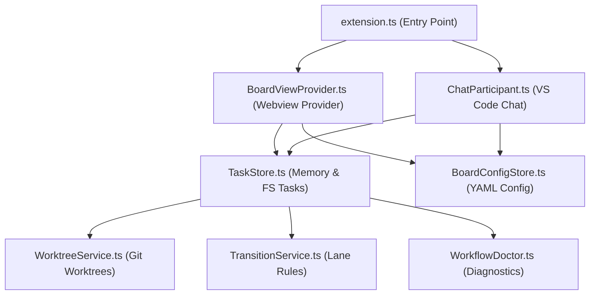

This page details the extension's internal components, service layers, and file layout.

---

## 1. Internal Component Map

---

## 2. Directory & Component Mapping

All source code resides in `src/`:

- **`src/extension.ts`** - The entry point of the extension, registering command palette commands, the Webview board provider, and the `@kanban` chat participant.
- **`src/BoardViewProvider.ts` / `src/KanbanEditorPanel.ts`** - Manages the VS Code Webview panel lifecycle, rendering HTML from `src/webview/`, and handling incoming JSON messages from the board.
- **`src/TaskStore.ts`** - The data persistence layer. Reads and writes Markdown frontmatter and bodies, indexes task relationships, and emits events on file changes.
- **`src/BoardConfigStore.ts`** - Loads and modifies `board.yaml`. Regenerates comment headers on write.
- **`src/WorktreeService.ts`** - Wraps Git CLI execution. Handles checking out new branches, creating worktree directories, and cleaning up on task archiving.
- **`src/TransitionService.ts`** - Evaluates lane move operations against policies defined in `board.yaml` (WIP limits, checklist completeness, etc.).
- **`src/WorkflowDoctor.ts`** - Scans the workspace and identifies structural, label, or path issues.
- **`src/webview/`** - Static files loaded into the Webview:
  - `board.ts` - The frontend controller. Sets up event listeners, handles drag/drop, filters, and renders tasks.
  - `board.css` - Styling variables and layout rules.
- **`src/test/`** - Vitest unit test files validating individual class methods.
