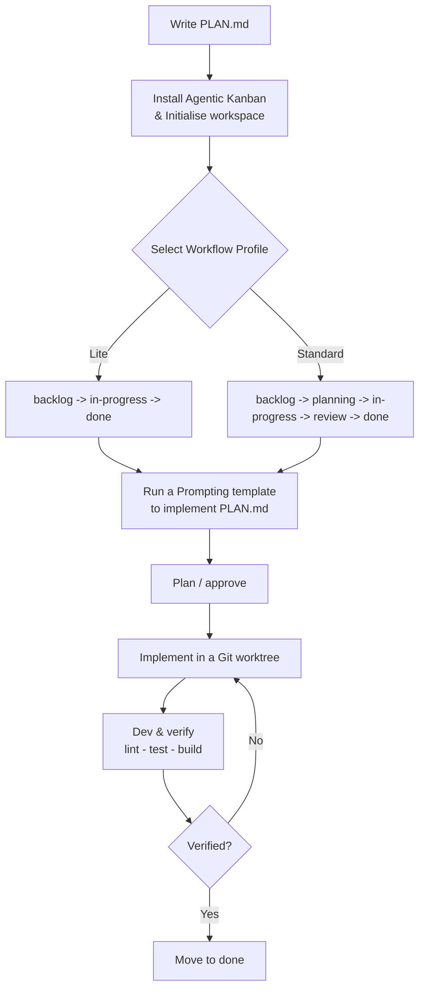

This guide walks through a complete feature task on the **Standard** profile — from creating a task to archiving it as done. Lite profile is the same but skips `planning` and `review`.



> See the [Prompting templates](/getting-started/prompting/) for copy-pasteable prompts to paste into your agent session at each stage.

---

## 1. Initialise the Workspace

1. Open your project workspace folder in VS Code.
2. Click the **Agentic Kanban** icon in the Activity Bar to reveal the board.
3. If this is a new workspace, click **Initialise** and select the **Standard** profile.

This creates the `.agentkanban/` workspace folder where all board state, prompts, and memory are stored.

---

## 2. Create and Select a Task

In the VS Code Chat panel, send a command to `@kanban` to create your task:

```text
@kanban /new Add OAuth2 login
```

Once created, make it the active task in the context:

```text
@kanban /task Add OAuth2 login
```

This opens the task file (`.agentkanban/tasks/task_<date>_<id>_add-oauth2-login.md`) and updates the `AGENTS.md` file at the root of your workspace to reference it.

---

## 3. Scaffold Specifications

To attach spec-driven artifacts to the selected task, run:

```text
@kanban /spec auth
```

On the **Standard** profile, this scaffolds the following change directory structure:
```text
.agentkanban/
  specs/
    auth/spec.md
  changes/
    add-oauth2-login/
      proposal.md
      design.md
      tasks.md
```

- `proposal.md` - Explains the *why* and scope of the change.
- `design.md` - Outlines the implementation approach.
- `tasks.md` - The authoritative checklist of tasks the coding agent will work against.
- `specs/auth/spec.md` - The shared capability specification detailing scenarios and acceptance criteria.

---

## 4. Plan and Approve (`planning`)

1. Move the task card from `backlog` to `planning` on the board UI.
2. Open and refine `proposal.md` and `design.md`.
3. Add checklist items under `tasks.md`.
4. When the plan is ready, **you** move it from `planning` to `in-progress` — this is the plan-approval human gate. The agent cannot cross this; it will wait for your move.

---

## 5. Implement in a Git Worktree (`in-progress`)

With the task in `in-progress`, create an isolated worktree branch to execute the work:

```text
@kanban /worktree
```

The extension creates a clean worktree folder outside your main repository and opens it in a new window.
1. Implement your code against the approved specs.
2. Mark items as completed (`- [x]`) in `tasks.md`.
3. Verify changes locally.

---

## 6. Review and Complete (`review -> done`)

1. Move the task to `review` on the board. Run lint, tests, and build to confirm everything passes.
2. Review the code. If changes are needed, move it back to `in-progress`.
3. Once verified, **you** move it to `done` — this is the completion human gate. Record evidence if required:
   ```text
   @kanban /evidence add-oauth2-login lint pass
   @kanban /evidence add-oauth2-login test pass
   @kanban /evidence add-oauth2-login build pass
   ```
4. Merge the worktree branch through your normal Git flow.
5. Archive the change folder to keep the repository clean:
   ```text
   @kanban /archive add-oauth2-login
   ```
