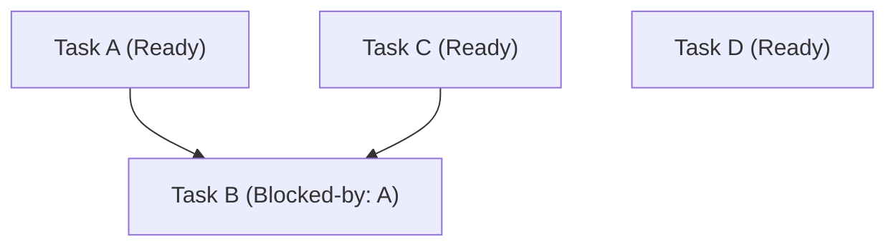

Agentic Kanban manages dependencies between tasks to ensure structured, sequential delivery. This is especially useful when orchestrating automated coding agents.

---

## 1. Defining Dependencies

Dependencies are declared directly inside the task's frontmatter using `dependsOn`:

```yaml
title: Implement OAuth2 login
dependsOn:
  - setup-database-schema
labels:
  - blocked-by:setup-database-schema
```

### The Ready Gate Guardrail
A task is considered **ready** only when all task slugs/IDs listed in its `dependsOn` list are in the `done` lane. 
- If any dependency is in `backlog`, `planning`, `in-progress`, or `review`, the dependent task is **blocked** and cannot be loop-processed.

---

## 2. Lane Loop (`/loop`)

The `@kanban /loop` command processes tasks in a specific lane using a loop-until-dry model. It automatically:
1. Filters out blocked tasks.
2. Runs verification commands against ready tasks.
3. Advances passing tasks to the next lane.
4. Marks failing tasks with a blocker label and records the output in the task conversation.
5. Repeats until no further tasks can be advanced in the lane.

> **Note:** `/loop` is profile-aware. Standard profile default source lane is `planning` (advances to `review`); `review` is refused as a source lane in Standard. Lite profile default source lane is `in-progress` (advances to `done`).

### Running a Loop
To loop all tasks currently in `in-progress` to `review`:

```text
@kanban /loop in-progress
```

### Advanced Filtering Options
You can narrow down the loop using filtering flags:
- **By Label:** `@kanban /loop in-progress --label=security`
- **By Priority:** `@kanban /loop in-progress --priority=high`
- **By Stack Pack:** `@kanban /loop in-progress --pack=odoo`

---

## 3. Parallel vs. Ordered Execution

During a loop, Agentic Kanban groups tasks into dependency levels:



- **Parallel Processing:** Independent ready tasks (like `Task A`, `Task C`, and `Task D`) can be executed concurrently.
- **Ordered Execution:** Dependent tasks (like `Task B`) are held back and will only be executed in a subsequent loop iteration *after* its blockers (`Task A` and `Task C`) successfully reach `done`.
