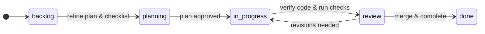

Agentic Kanban supports two primary workflow profiles: **Lite** and **Standard**. The profile determines the available lanes, policies, and safeguards.

---

## Profile Comparison

| Feature | Lite | Standard |
| --- | --- | --- |
| **Lanes** | `backlog -> in-progress -> done` | `backlog -> planning -> in-progress -> review -> done` |
| **Worktrees** | Optional | Required by default |
| **WIP Limits** | Warn-only | Enforced (default `in-progress: 1`) |
| **Review Lane** | None | Yes (human gate `review -> done`) |
| **Typical Scope** | Small bug fixes, simple docs, or personal projects | Core features, complex changes, or multi-agent environments |

---

## 1. Lite Profile

The **Lite** profile is designed for lightweight, high-velocity tasks. It provides a simple, direct path from backlog to completion:
- **Lanes:** Includes only `backlog` (task defined), `in-progress` (active implementation), and `done` (completed).
- **Guidelines:**
  - Tasks don't go through a formal plan-approval or review stage.
  - Worktrees are optional, allowing you to edit the main workspace directly.
  - Enforcement defaults to `warn`, permitting quick moves without blocking.

---

## 2. Standard Profile

The **Standard** profile separates planning, implementation, and code verification, providing guardrails that prevent mistakes:
- **Lanes:** Adds `planning` (scaffolding specs, defining proposal and tasks) and `review` (verifying implementation before merging).
- **Guidelines:**
  - **Plan Approval Gate:** The transition from `planning` to `in-progress` represents a plan-approval gate. To pass, the task must have a checklist with at least one item, and spec-driven tasks must have valid spec files.
  - **Completion Gate:** Moving from `review` to `done` represents code approval. Standard policies require running configured tests and linting before entering the review lane.
  - **Git Worktrees:** Required for implementation to isolate active changes.
  - **WIP Limits:** Set to strict enforcement (default `in-progress: 1`) to ensure focus.

---

## Choosing a Profile

- **Use Lite when:**
  - Making simple updates (e.g., typos, formatting, updating readmes).
  - Working on a small personal project.
  - Doing fast-path exploratory spikes.
- **Use Standard when:**
  - Building core application features or API changes.
  - Working with coding agents where you want to review their plans *before* they write any code.
  - Collaborating in teams where code review and verification policies are strictly required.
